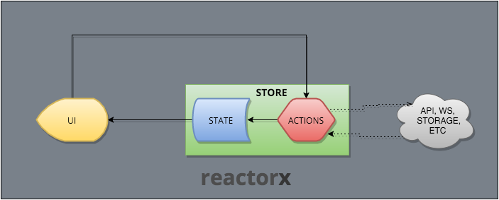

reactorx
========

`reactorx` is a simple, small and pragmatic [Flux](https://facebook.github.io/flux/) implementation.

## Features
- Simple: One store with a state (plain javascript object) that is mutated only by actions (plain javascript functions) you define.
- Small: Around 70 LOC.
- Pragmatic: Very practical and terse. No boilerplate.
- Universal/Isomorphic and works with react-native.

## Diagram


Unidirectional flow, state access is sequentialized by the underlying [js-csp](https://github.com/ubolonton/js-csp) library.

## Usage

Let's recreate the counter example

```
import React from 'react'
import { render } from 'react-dom'

import { createStore } from 'reactorx'

// Define a plain object tree as the state of your application
let initialState = {
    counter: 0,
}

// actions are defined as methods of an object
let actions = {
    increment: ({state, actions}, delta) => {
        return {
            ...state,
            counter: state.counter+delta
        }
    },

    decrement: ({state, actions}) => {
        return {
            ...state,
            counter: state.counter-1
        }
    },
}

// Let's use React to render the user interface
// https://facebook.github.io/react/docs/reusable-components.html#stateless-functions
function App({store}) {
    let { state, actions } = store

    return (
        <div>
            <div>Counter: {state.counter}</div>
            <button onClick={() => actions.increment(2)}>+2</button>
            <button onClick={() => actions.decrement()}>-</button>
        </div>
    )
}

// Create the store
let store = createStore(initialState, actions)

// Define a callback to receive changes to the state
store.subscribe( store => {
    render(
        <App store={store} />,
        document.getElementById('mnt')
    )
})
```

## Installation
`reactorx` is built on top of [js-csp](https://github.com/ubolonton/js-csp), which is included in the distribution.

You still need to install babel-polyfill (npm install --save babel-polyfill).

This is because Safari (most notably) doesn't support generators yet, so we need to bake in the support for those features.

```
import 'babel-polyfill'
// then
import React from 'react'
```

## API
Although `reactorx` is designed with ES6 in mind, and as such, a transpiler is required, it's compatible with es5.

The examples contained in the repo provide a hot-reloadable dev environment based on Webpack and Babel 6.


### createStore
`createStore(initialState, actions, optionals = {}, capacity = 623)`
```
@param {object} state - Object tree with the initial state of the store
@param {object} actions - Object with methods that represent actions
@param {object} optionals (defaults to {})- This parameter will be sent to each action as an additional argument
@param {integer} capacity (defaults to 623) - Buffer size of the underlying dispatch queue
@return {object} - Returns the store, composed of a subscribe function and an actions property
```
The store returned by createStore has the following responsibilities:
- Holds application state

- Registers a callback to notify changes via `subscribe(callback)`

- Allows state to be mutated via a collection of `actions`

The subscribe callback function receives the current state of the store and all the actions that can be invoked to mutate this state
```
function callback({state, actions}) {
    console.log('state: ', state)
}
store.subscribe(callback)
```

### actions
Each action must have the following signature:
`action({state, actions, opts}, ...args)`

Actions are defined as methods of an object.

```
const actions = {
    addTodo: ({state, actions, opts}, text) => {
        return {
            ...state,
            todos: [
                 {
                    id: state.todos.reduce((maxId, todo) => Math.max(todo.id, maxId), -1) + 1,
                    completed: false,
                    text,
                },
                ...state.todos
            ]
        }
    }
}
```

Each method ***must*** return a state.

This state can be the same as the previous one (just return state) or a new state object with changes.


***Do not*** modify the state object you receive in the action. Always return a new object.


You can perform any operation within the action, such as
- Mutate state by creating a new state object with some properties changed

A common pattern would be
```
return {
        ...state,
        changedProperty: newValue
}
```

- Dispatch other actions
```
const actions = {
    fetchPosts: ({state, actions, opts: {api}}, reddit}) => {
        api.fetchPosts(reddit)
            .then(json => actions.postsFetched(reddit, json))

        return state
    },

    postsFetched: ({state}, reddit, items) => {
        let posts = state.postsByReddit[reddit]

        return {
            ...state,
            postsByReddit: {
                ...state.postsByReddit,
                [reddit]: Object.assign({}, posts, {
                    isFetching: false,
                    didInvalidate: false,
                    posts: items.data.children.map(child => child.data),
                    lastUpdated: Date.now(),
                })
            }
        }
    }
}
```
Notice how you invoke the actions (`actions.postsFetched(reddit, json)`) without the first argument of the signature ({state, actions, opts}).

This is because the framework adds it automatically.


## Universal app
Something like the following, allows you to build a universal application

server.js
```
...
app.use( (req, res) => {
    const counter = req.query.counter || 0

    let store = createStore({counter}, actions)

    store.subscribe( store => {
        const html = renderToString(<App store={store} />)

        res.set("Content-Type", "text/html")
        res.send(`
            <!doctype html>
            <html>
                <head><title>reactorx universal example</title></head>
                <body>
                    <div id="mnt">${html}</div>
                    <script>
                        window.__INITIAL_STATE__ = ${JSON.stringify(store.state)}
                    </script>
                    <script src="/static/bundle.js"></script>
                </body>
            </html>
        `)
    })
})
...
```

client.js
```
...
let initialState = window.__INITIAL_STATE__

let store = createStore(initialState, actions)

store.subscribe( store => {
    render(
        <App store={store} />,
        document.getElementById('mnt')

    )
})
```
## Examples
Check the [examples](examples/) folder for additional demos.

[unBALANCE](https://github.com/jbrodriguez/unbalance) is an app that uses `reactorx`. Check the code for a real world example.

## License
MIT
